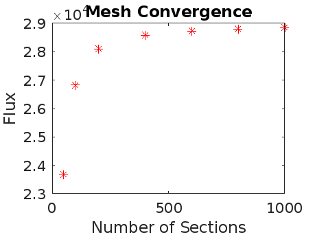
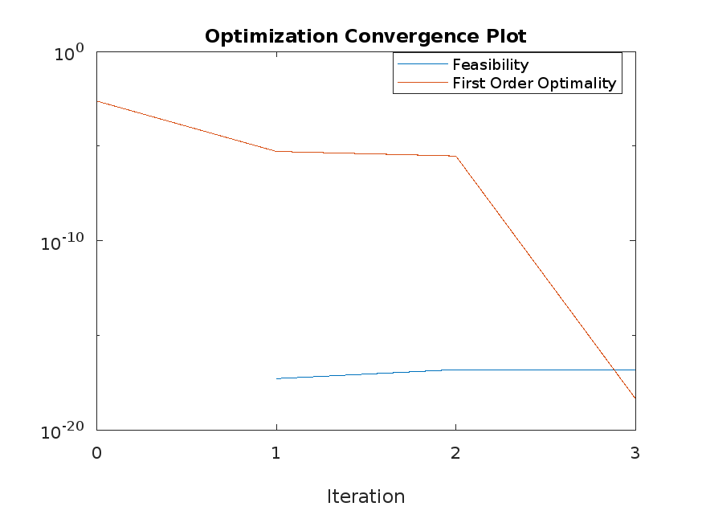
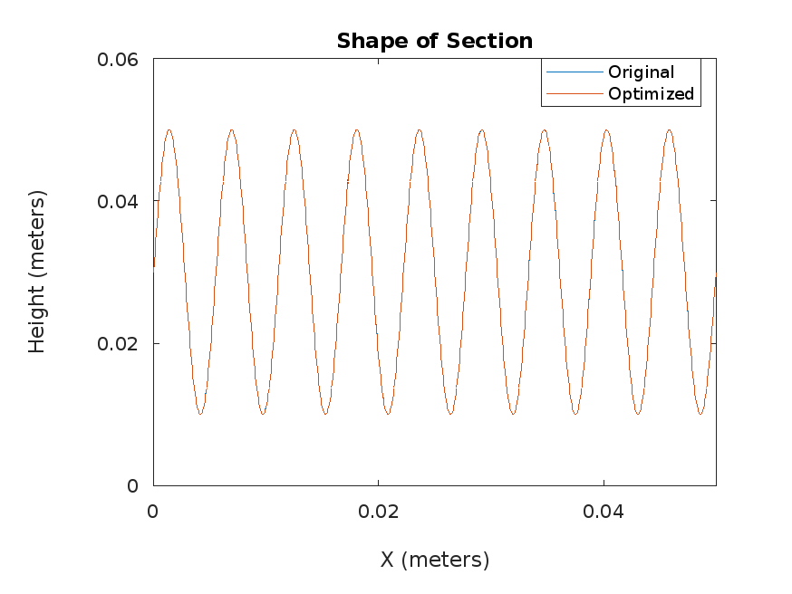

# Project 1: Heat Exchanger
The goal of the project was to find the optimal shape for heat exchanger to transfer the most heat possible to air. This would require the heat flux through the section to be maximized.

## Background
The temperature of the water and air were assumed to be uniform at 90°C and 20°C, respectively. The exchanger would made of a steel alloy with a constant thermal conductivity of 20 $\frac{W}{mK}$ with a nominal heat flux assumed to be 7000 $\frac{W}{m}$. The length of the section being analyzed is 5 cm with a height that ranges from a minimum of 1 cm to a maximum of 5 cm.

In order to use the optimize the shape numerically, the shape must be represented numerically. The shape can be modeled as the function of the height (h) at a given point along the length (x). The height function is given below for the length of the cross section (L).

$$h\left(x\right)=a_1+\sum_{k=2}^{n}{a_ksin{\left(\frac{2\pi\left(k-1\right)}{L}x\right)}}$$

The design variables being optimized are given as a vector (a) with a length of n. 

## Results

