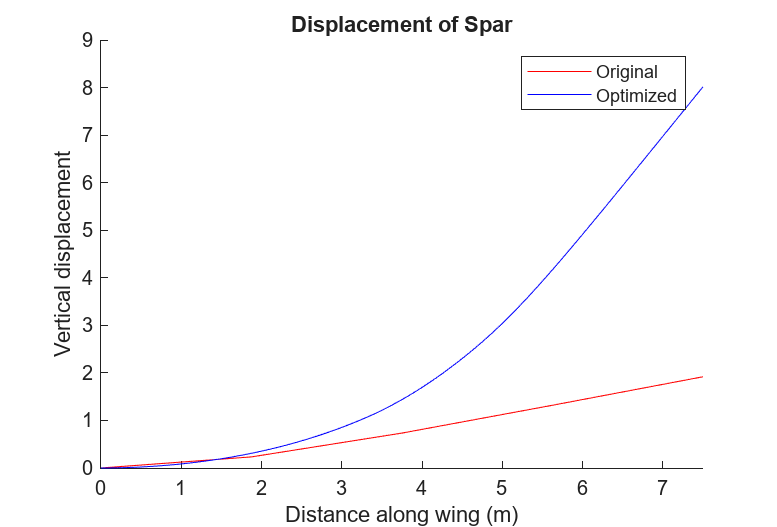
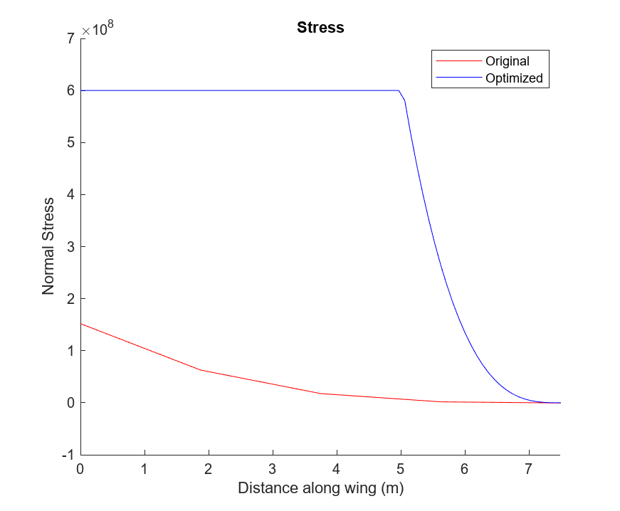
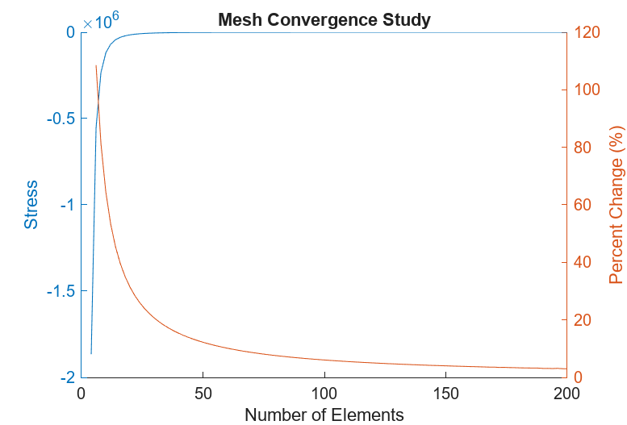
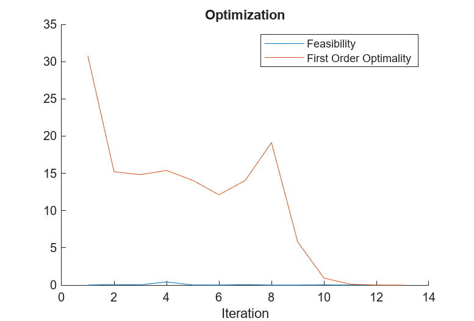

# Project 2: Spar

## Summary
The goal of this project was to design the spar of a wing that would be as light as possible without the stress exceeding the ultimate strength during a 2.5g maneuver. 

## Background
The spar cross-section would be a circular annulus (Figure 1) with varying radii along the length of the wing. The spar was constructed from carbon fiber composite, which has a density 1600 $\frac{kg}{m^3}$, a Young’s modulus of 70 GPa, and an ultimate tensile and compressive strength 600 MPa. 
The inner radius must be smaller than 1cm, the outer radius cannot be larger than 5cm, and the thickness between them must be larger than 2.5mm. From these constraints it can be determined that the outer radius must be greater than 1.25cm and the inner radius must be less than 4.75cm. The stress on the spar due to this force cannot exceed the ultimate tensile and compressive stress of the composite material. 
$$\frac{F_g}{2}=A → \frac{2.5g \times m}{2}=\frac{q_0 L}{2}→q_0=\frac{2.5g \times m}{L}$$

The optimized design of the spar must be able to hold the weight of the plane during a maneuver that results in a 2.5 g-force. The total force on each of the two wings would need to be equal to half the force on the plane with a triangular-shaped distribution across the wing with an initial force-per-length of q0 and 0 at the tip (Equation 1). 
$$V=(R_1^2+R_1 R_2+R_2^2 )h\frac{\pi}{2}$$
Equation 3
$$m=(V_{out}-V_{in})\rho$$
Equation 2 represents the equation for the volume (V) of a truncated cone where h is the height of the cone, R1 represents the radius of the cone at the base, and R2 represents the radius at the end. The total volume of the spar can be calculated by subtracting the volume from the outer radius from the volume found using the inner radius. The mass of the spar is equal to the total volume  
The program would utilize the complex step method to approximate partial derivatives. The complex step method utilizes complex numbers to act as a point on a plane. Complex numbers are numbers that include an imaginary number (i), which represents the square root of negative one. This results in a much smaller error than other derivative approximations, such as forward-difference and central-difference. This method is easy to implement in various applications, but the computational cost scales with the amount of design variables being tested. 

## Implementation
The initial radii of the nodes of the spar are listed in a column array in pairs of inner and outer radii, respectively. The number of pairs in the array would need to be equal to the number of nodes, which can be found by adding one to the number of elements. The resulting array is twice the number of nodes; an example is shown below.

Equation 4
$$r = \begin{bmatrix}
r_{inner,1}\\
r_{outer,1}\\
r_{inner,2}\\
r_{outer,2}\\
\vdots\\
\end{bmatrix}$$

The weight of the spar was determined using the radius design variables array with the <a href="./Objective.m">Objective function</a>. The radii that would result in the least weight was found using MATLAB’s fmincon function, which would be limited by an A and b inequality matrix, upper and lower bound arrays, as well as non-linear constraints. The A and b inequality matrices are used by fmincon by the following equation:

Equation 5
$Ax\leq b$

Equation 6
$$A=\begin{bmatrix}
1 & -1 & 0 & 0 & 0 & 0 & \cdots \\
0 & 0 & 1 & -1 & 0 & 0 & \cdots\\
0 & 0 & 0 & 0 & 1 & -1 & \cdots\\
\vdots & \vdots & \vdots & \vdots & \vdots & \vdots & \ddots
\end{bmatrix}$$

The A inequality matrix shown above (Equation 6) corresponds to a positive identity matrix for the inner radius values and a negative identity matrix for the outer radius. The matrix has an equal number of rows and columns as the nodes and variables, respectively. This results in a constraint that ensures that the difference between the inner and outer radius remains greater than the minimum thickness in the b inequality array (Equation 5). The function was also constrained by stress in the nonlin function (nonlin.m), which prevented the design variables from resulting in a stress greater than the ultimate tensile or compressive strength. 
The fmincon function would find the design variables that produce the smallest mass found by the objective function (ObjectiveCS.m). The gradient of this function was found by the program using the complex step method. The stress on the spar is found using the provided functions, CalcBeamDisplacement.m to find the vertical displacement (Figure 5) that was used with CalcBeamStress.m to find stress (Figure 6). The Jacobian matrix of this constraint was calculated using the complex step method before being implemented into fmincon.
In order to find the best number of elements to use when optimizing, the stress at the tip of the spar was calculated for various numbers of elements. The stress at the tip is known to be zero; any deviation from that is an error that can be measured. The resulting plot is shown in the mesh convergence study (Figure 7) from which a value was chosen that had a small % change without overloading the computation.

## Results

<figcaption>Figure 4: Model of Optimized Spar Geometry</figcaption>

<figcaption>Figure 5: Plot of vertical displacement</figcaption>

<figcaption>Figure 6: Plot of stress on spar</figcaption>

<figcaption>Figure 7: Mesh Convergence Plot</figcaption>

The mesh convergence study tested the error found through the stress with the number of elements increasing from an initial value of 4 to 200. The number of elements used for the optimization was found by finding where the percent change was below 5%, which resulted in 122 elements.

<figcaption>Figure 8: Plot of feasibility</figcaption>

The mesh convergence study tested the error found through the stress with the number of elements increasing from an initial value of 4 to 200. The number of elements used for the optimization was found by finding where the percent change was below 5%, which resulted in 122 elements.

## Conclusion 
The final mass found by the program was roughly 4.9 kg, this is 92% less than the nominal mass of 13.26 kg. This demonstrates that the program was able to reduce the mass of the spar, while the figures in the Results section show the resulting design does not exceed the limits. The final shape of the spar appears to match the radius and thickness of the initial guess, before shrinking along the length.

Both displacement and stress increased in the optimized spar compared to the initial geometry. The plot of stress (Figure 6) shows the optimized spar does not exceed the ultimate strength of the material but does hold near the limit. This is expected because the lighter spar produces more displacement and therefore greater stress. 

