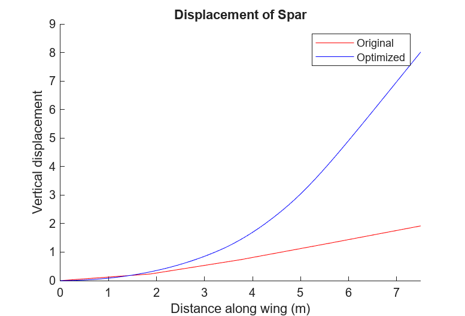
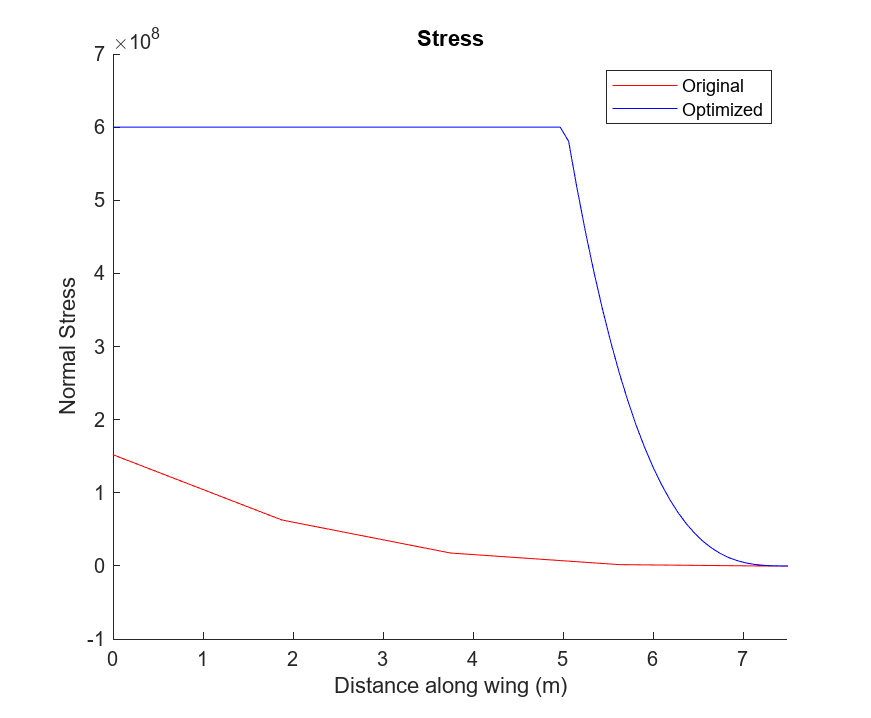
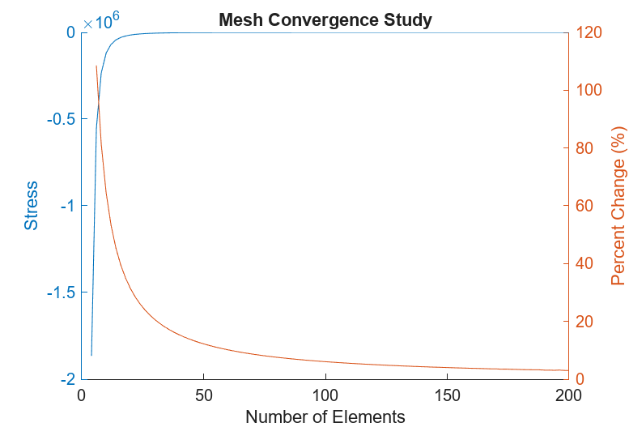
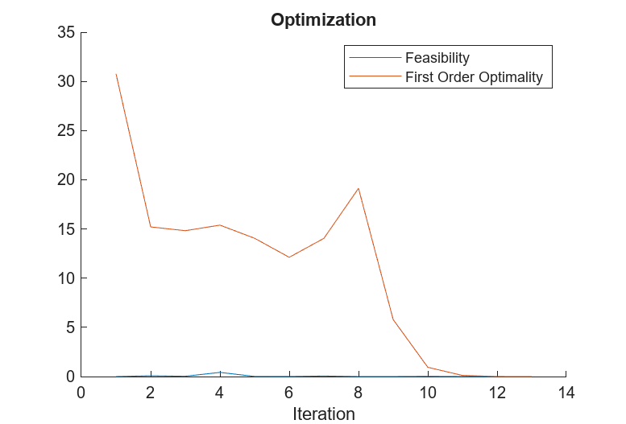

# Project 2: Spar

## Summary
The goal of this project was to design the spar of a wing that would be as light as possible without the stress exceeding the ultimate strength during a 2.5g maneuver. 

## Results

<figcaption>Figure 4: Model of Optimized Spar Geometry</figcaption>

<figcaption>Figure 5: Plot of vertical displacement</figcaption>

<figcaption>Figure 6: Plot of stress on spar</figcaption>

<figcaption>Figure 7: Mesh Convergence Plot</figcaption>

The mesh convergence study tested the error found through the stress with the number of elements increasing from an initial value of 4 to 200. The number of elements used for the optimization was found by finding where the percent change was below 5%, which resulted in 122 elements.

<figcaption>Figure 8: Plot of feasibility</figcaption>

The mesh convergence study tested the error found through the stress with the number of elements increasing from an initial value of 4 to 200. The number of elements used for the optimization was found by finding where the percent change was below 5%, which resulted in 122 elements.

## Conclusion 
The final mass found by the program was roughly 4.9 kg, this is 92% less than the nominal mass of 13.26 kg. This demonstrates that the program was able to reduce the mass of the spar, while the figures in the Results section show the resulting design does not exceed the limits. The final shape of the spar appears to match the radius and thickness of the initial guess, before shrinking along the length.

Both displacement and stress increased in the optimized spar compared to the initial geometry. The plot of stress (Figure 6) shows the optimized spar does not exceed the ultimate strength of the material but does hold near the limit. This is expected because the lighter spar produces more displacement and therefore greater stress. 

