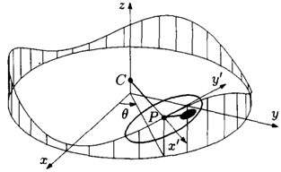
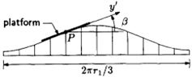
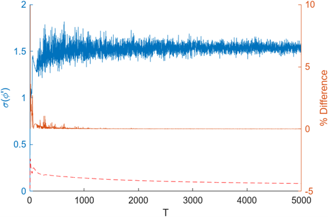
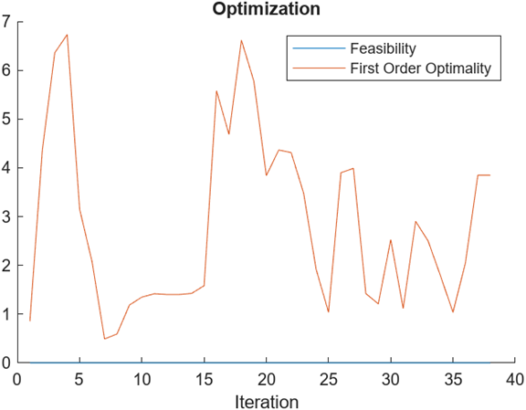

# Project 3: Tilt-A-Whirl
## Summary
The goal of this project is to maximize the standard deviation of each car on a platform to ensure the most random motions. A surrogate model found using the GPML library was used to calculate the optimal values of the design variables. The optimized design variables result in an optimized standard deviation of 2.64.
## Problem Statement
The Tilt-A-Whirl being modeled is shown below in Figure 1 to Figure 4. The position of the car is dependent on the radial arm of the ride to the center of each platform (r1), angle of r1 (θ), the radial arm length from the center of the platform (r2), the angle between r1 and r2 (φ), and the angle of the incline (α).
 	 
Figure 1: Plan view of idealized Tilt-A-Whirl

Figure 2: Perspective View of Tilt-A-Whirl

 	 
Figure 3: Vertical Cross Section of the Tilt-A-Whirl

Figure 4: Vertical Cross Section with Car Motion Tangent to Track

$r_1$ is constant at 4.3 meters and the offset of the incline ($\alpha_0$) is constant at 0.036 radians. The quality factor ($Q_0$) is assumed to be 20 constantly, unlike a real system which would vary due to friction.

## Analysis
Standard deviation is the measure of variation in a set of data. A larger deviation corresponds to more random and less predictable results from the Tilt-A-Whirl. A gaussian process was used to generate a surrogate function to approximate standard deviation. A surrogate function can provide a multimodal design space to find a global minimizer. This function can change with each generation from the randomized samples of the design variables. This method provides an approximation of the minimizer from varied data. 

The sample points used for the surrogate plot were found using Latin Hypercube Sampling (LHS) where the ranges of design variables are split into sections called “bins” with equal probability, with samples taken from each been with no two samples in the same bin. The samples can be calculated with the following equation:
Equation 1: LHS Formula
$$x_i^{\left(j\right)}=\frac{\pi_i^{\left(j\right)}+U_i^{\left(j\right)}}{s}$$
$$1\le i\le n;
1\le j\le s$$
s is the number of bins, n is the number of design variables, $\pi_i^{\left(j\right)}$ is a random permutation of the sequence from zero to s-1, $U_i^{\left(j\right)}$ is a uniformly distributed random number between zero and one where the superscript (j) is the column index and the subscript i is the row index.

## Optimization Method
Samples of the design variables were generated using Latin Hypercube Sampling by utilizing MATLAB’s lhsdesign function. A plot of the standard deviation that resulted from the samples were plotted against one of the design variables. The values were plotted against angular velocity because the objective of the project is to find the largest standard deviation of the angular velocity. This plot was used to generate a surrogate function with the GPML library (Figure 6). The negative of this surrogate would be input into fmincon to find the design variables that result in the minimum standard deviation.
### Objective Function
The standard deviation of the rotational velocity is calculated with the MATLAB ode45 function. The function is given a column array “y” (Equation 2) with $\phi$ as the first variable, and its derivative with respect to the nondimensional time ($\tau$). The function outputs the derivative of the array (Equation 3).
Equation 2: Initial Column Array
$$y=\left[\begin{matrix}\phi\\\frac{d\phi}{d\tau}\\\end{matrix}\right]$$
Equation 3: Derivative Column Array
$$\frac{dy}{d\tau}=\left[\begin{matrix}\frac{d\phi}{d\tau}\\\frac{d^2\phi}{d\tau^2}\\\end{matrix}\right]\$$
The equation to calculate the second derivative of φ with respect to τ was input into ode45 (Equation 4).
Equation 4: Second Derivative of φ  
$$\frac{d^2\phi}{d\tau^2}+\frac{\gamma}{Q_0}\frac{d\phi}{d\tau}+\ \left(\epsilon-\gamma^2\alpha\right)\sin{\left(\phi\right)}+\ \gamma^2\beta\cos{\left(\phi\right)}=0
\epsilon=\frac{r_1}{9r_2}
\gamma=\frac{1}{3\omega}\sqrt{\frac{g}{r_2}}
\tau=3\omega t
\alpha=\alpha_0-\alpha_1\cos{\left(\tau\right)}
\beta=3a_1\sin{\left(\tau\right)}$$
This output value was then used to calculate the standard deviation using the following equation.
Equation 5: Standard Deviation of $\phi$
$$f\left(x\right)=\sigma\left(\frac{d\phi}{d\tau}\right)=3\omega\sqrt{\frac{\int_{0}^{T}\left(y_2-{\bar{y}}_2\right)d\tau}{T}}$$
$$y_2=\frac{d^2\phi}{d\tau^2}$$
$${\bar{y}}_2=\frac{\int_{0}^{T}y_2d\tau}{T}$$

The integration was performed by the MATLAB `trapz` function which calculates the trapezoidal integration of an array. 
Design Variables
The design variables in this project consist of the angular velocity ($\omega$), the radial arm length ($r_2$), and the incline angle of the car platform ($\alpha_1$). The angular velocity of the overall ride represents the change of the angle ($\theta$) of the radial arm length ($r_1$) over time. The radial arm length is the distance of the car from the center of the platform. The last variable represents the maximum and minimum incline angle from the ride to the car platform ($\alpha_1$). The design variables are stored in a column array as shown in Equation 6.

Equation 6: Design Variable Column Array: $$x=\left[\begin{matrix}\omega\\r_2\\\alpha_1\\\end{matrix}\right]$$

The nominal values of the design variables are 6.5 rpm, 0.8 meters, and 0.058 radians for the angular velocity, radial arm, and the incline angle, respectively.
### Constraints
$$3\ rpm\le\omega\frac{60}{2\pi}\ rpm\le8\ rpm$$
$$0.1\ m \le r_2 \le 1.5\ m$$
$$0\ rad\le\alpha_1\le0.3\ rad$$

The nominal standard deviation vs the length of the period (Figure 5) was used to find an acceptable period (T). 
## Results
The convergence plot (Figure 5) shows the standard deviation of the nominal values ($\sigma\left(\phi^\prime\right)$) approach the average of 1.5165 as the length of the period (T) increases. The T used in the project was selected by plotting the standard deviation of the values shown below as a red dotted line, and finding the location where the change was acceptably small.
 
Figure 5: Convergence Study

The average difference between the point and the average decreases as the period increases. From this plot the T value of 608 was selected because it was the period that corresponded to a change in the deviation less than 0.001%.
The surrogate plot (Figure 6) shows the plot of the 
with the standard deviation of the surrogate function shown as the grey area region.
 
Figure 6: Plot of Surrogate Function

Figure 7: Feasibility

## Conclusion 
The optimized values for the design variables were found to be 7.7265 radians per second, 1.325 radians, and 0.2627 meters respectively. These optimized values result in a standard deviation of 2.642, which is 185.7% greater than the standard deviation found using the nominal values of 1.567.