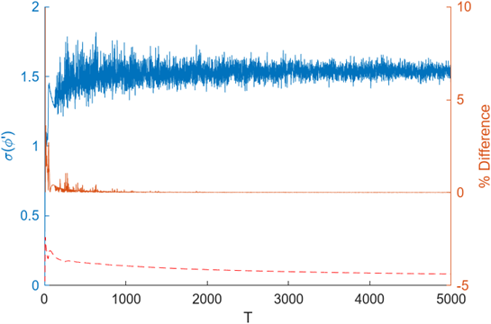
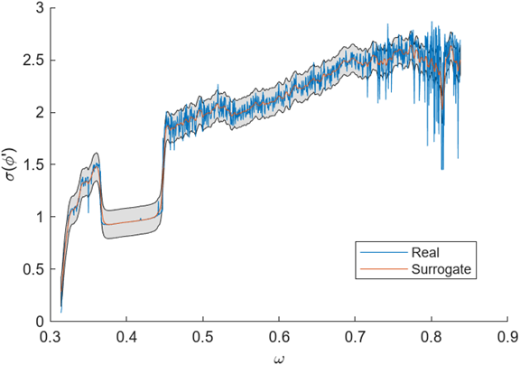
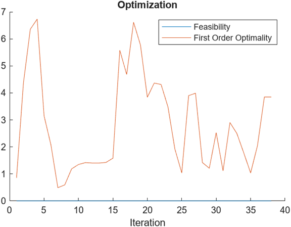

# Project 3: Tilt-A-Whirl
## Summary
The goal of this project is to maximize the standard deviation of each car on a platform to ensure the most random motions. A surrogate model found using the GPML library was used to calculate the optimal values of the design variables. The optimized design variables result in an optimized standard deviation of 2.64.

## Results
The convergence plot (Figure 5) shows the standard deviation of the nominal values ($\sigma\left(\phi^\prime\right)$) approach the average of 1.5165 as the length of the period (T) increases. The T used in the project was selected by plotting the standard deviation of the values shown below as a red dotted line, and finding the location where the change was acceptably small.
 
Figure 5: Convergence Study

The average difference between the point and the average decreases as the period increases. From this plot the T value of 608 was selected because it was the period that corresponded to a change in the deviation less than 0.001%.
The surrogate plot (Figure 6) shows the plot of the 
with the standard deviation of the surrogate function shown as the grey area region.
 
Figure 6: Plot of Surrogate Function

Figure 7: Feasibility

## Conclusion 

The optimized values for the design variables were found to be 7.7265 radians per second, 1.325 radians, and 0.2627 meters respectively. These optimized values result in a standard deviation of 2.642, which is 185.7% greater than the standard deviation found using the nominal values of 1.567.
