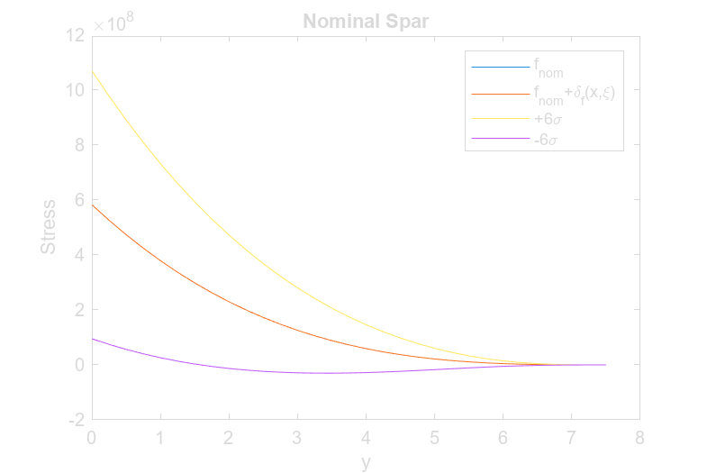
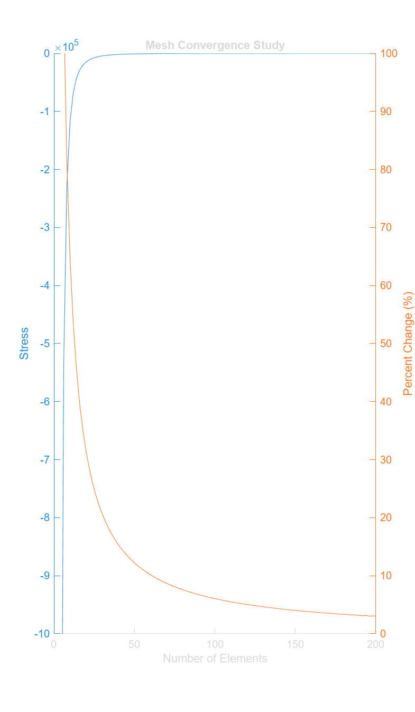
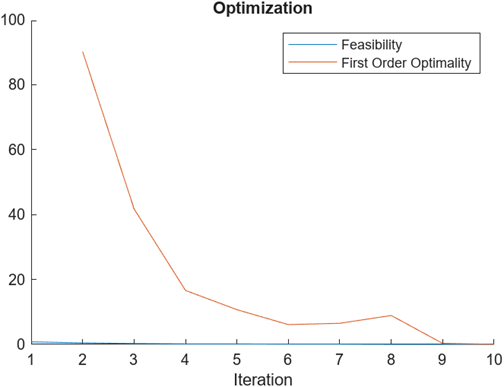
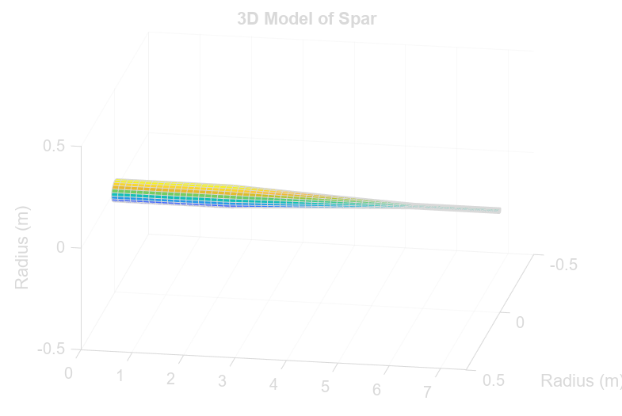
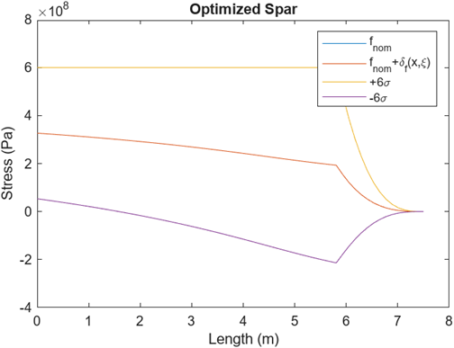

# Project 4: Wing Spar
## Summary
The goal of this project was to design the spar of a wing that would be as light as possible without the stress exceeding the ultimate strength under uncertain loading during a 2.5g maneuver. In real-life applications of the design, the loading on spar would not be consistent. To account for possible uncertainty, random variations are added to the loading on the spar. 
The inner radius must be smaller than 1cm, the outer radius cannot be larger than 5cm, and the thickness between them must be larger than 2.5mm. From these constraints it can be determined that the outer radius must be greater than 1.25cm and the inner radius must be less than 4.75cm. The stress on the spar due to this force cannot exceed the ultimate tensile and compressive stress of the composite material. 
Background
The spar cross-section would be a circular annulus (Figure 1) with varying radii along the length of the wing. The spar was constructed from carbon fiber composite, which has a density 1600 kg/m3, a Young’s modulus of 70 GPa, and an ultimate tensile and compressive strength 600 MPa. 

Equation 1
$$m=\left(V_{out}-V_{in}\right)\rho$$

Equation 2
$$V=\left(R_1^2+R_1R_2+R_2^2\right)h\frac{\pi}{2}$$
Equation 2 represents the equation for the volume (V) of a truncated cone where h is the hight of the cone, R1 represents the radius of the cone at the base and R2 represents the radius at the end. the total volume of the spar can be calculated by subtracting the volume from the outer radius from the volume found using the inner radius. The mass of the spar is equal to the total volume  
Equation 3
$$f_{nom}\left(x\right)=\frac{2.5W}{L}\left(1-\frac{x}{L}\right)$$
The optimized design of the spar must be able to hold the weight of the plane during a maneuver that results in a 2.5 g-force. Ideally, the force applied (Equation 3) would have a maximum at the base of the spar (x = 0) with a constant decrease resulting in no force at the tip (x = L). To add uncertainty a perturbation (Equation 5) was added to the force applied (Equation 4).
Equation 4
$$f\left(x,\xi\right)=f_{nom}\left(x\right)+\delta_f\left(x,\xi\right)$$
Equation 5
$$\delta_f\left(x,\xi\right)=\sum_{n=1}^{m}{\xi_n\cos{\left(\frac{\pi x\left(2n-1\right)}{2L}\right)}}$$
Equation 6
$$\xi_n~\mathcal{N}\left(0,\frac{f_{nom}\left(0\right)}{10n}\right)$$

The values of the random variable (ξ) have a mean of 0 and a standard deviation found from the nominal force at the base (Equation 6). The expected value of the stress is calculated by summing the weighted values of the function (Equation 7).
Equation 7
$$E\left(f\right)=\sum{w_if\left(x_i\right)}$$
The variance is calculated by subtracting the square of the expected value from the expected value of the function squared.
Equation 8
$$\sigma^2=E\left(f^2\right)-E\left(f\right)^2$$
The program would utilize the complex step method to approximate partial derivatives. The complex step method utilizes complex numbers to act as a point on a plane. Complex numbers are numbers that include an imaginary number (i) which represents the square root of negative one. This results in a much smaller error than other derivative approximations such as forward-difference and central-difference. This method is easy to implement in various applications, but the computational cost scales with the amount of design variables being tested. 
Optimization Method
In order to find the best number of elements to use when optimizing, the stress at the tip of the spar was calculated for various numbers of elements. The stress at the tip is known to be zero, therefore any deviation from that is an error that can be measured. The resulting plot is shown in the mesh convergence study (Figure 3) from which a value was chosen that had a small % change without overloading the computation.
Three-point Gauss-Hermite quadrature was used for the vaules random variables and weights. The weighted value of the perturbation were added to the force array to calculate a displacement and stress. The perturbed stress function (Perturbation.m) was added to the nonlinear stress constraint which calculates its gradient using the complex step meathod. The fmincon function would use to find the design variables that produce the smallest mass found by the objective function. 
Results
Given the nominal values for force, the strain outputs the following plot. 

Figure 2: Stress on Nominal Spar

Figure 3: Mesh Convergence Plot

The mesh convergence study tested the error found through the stress with the number of elements increasing from an initial value of 4 to 200. The number of elements used for the optimization was found by finding where the percent change from the previous point was below 10%, which resulted in 62 elements.
 
Figure 4: Plot of feasibility

Figure 4 shows the feasibility of each iteration of the fmincon function.
  
Figure 5: Cross section of top half of spar

The above figure shows the cross section of the top half of the spar along the length of the wing. A 3-dimentional model of the optimized geometry of the spar is shown below.
  
Figure 6: Model of Optimized Spar Geometry

Figure 7: Plot of stress on spar

The resulting stress plot (Figure 7) show the mean stress with six standard deviations is consistent with the optimized stress from project 2. This is expected because the lighter spar would result in greater stress, limited to the ultimate stress of 600 MPa. This causes the stress to remain near or at the upper limit.

## Conclusion 
The final design of the spar would be able to withstand a much greater force applied to the plane at the expense of adding mass. The final weight of the spar was 8.0681 kg. The weight of the spar without the variation is 4.9 kg; by adding uncertainty, the weight increases by 3.1681 kg (48.859%). This added weight would allow the plane to be much safer in flight.
