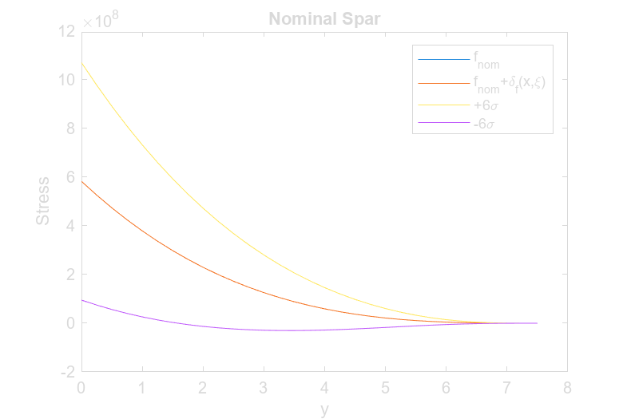
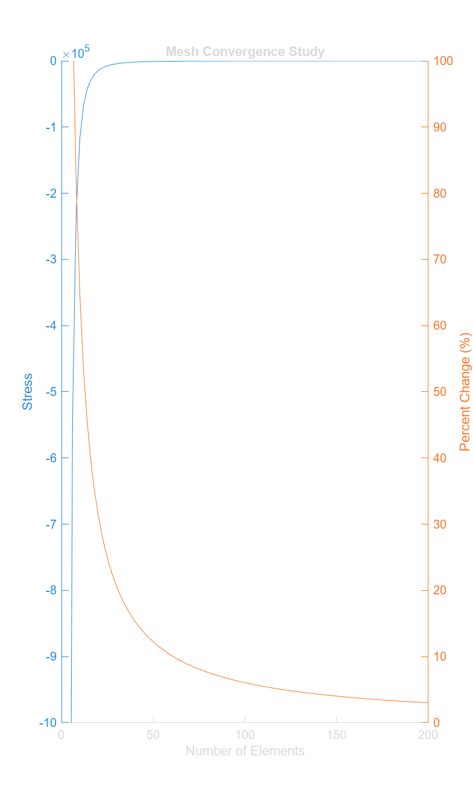
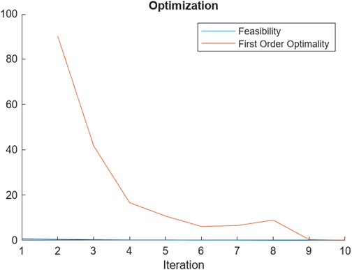
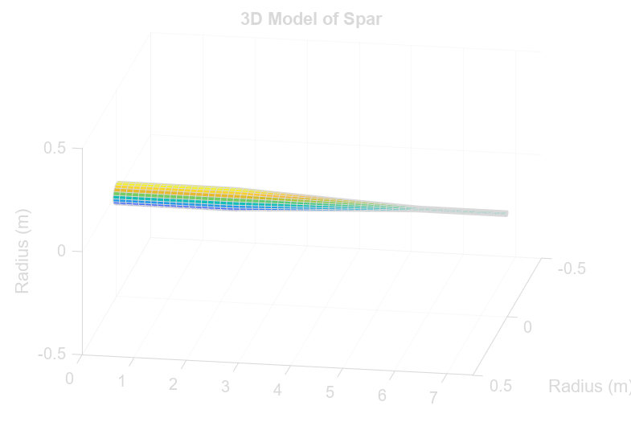
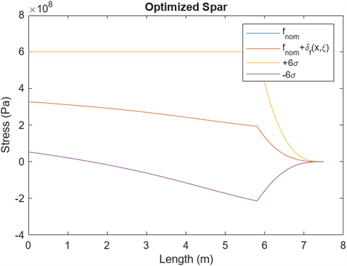

# Project 4: Wing Spar
## Summary
The goal of this project was to design the spar of a wing that would be as light as possible without the stress exceeding the ultimate strength under uncertain loading during a 2.5g maneuver. In real-life applications of the design, the loading on spar would not be consistent. To account for possible uncertainty, random variations are added to the loading on the spar. 
The inner radius must be smaller than 1cm, the outer radius cannot be larger than 5cm, and the thickness between them must be larger than 2.5mm. From these constraints, it can be determined that the outer radius must be greater than 1.25cm and the inner radius must be less than 4.75cm. The stress on the spar due to this force cannot exceed the ultimate tensile and compressive stress of the composite material. 

## Results
Given the nominal values for force, the strain outputs the following plot. 

Figure 2: Stress on Nominal Spar

Figure 3: Mesh Convergence Plot

The mesh convergence study tested the error found through the stress with the number of elements increasing from an initial value of 4 to 200. The number of elements used for the optimization was found by finding where the percent change from the previous point was below 10%, which resulted in 62 elements.
 
Figure 4: Plot of feasibility

  
Figure 5: Cross-section of top half of spar

The above figure shows the cross-section of the top half of the spar along the length of the wing. A 3-dimentional model of the optimized geometry of the spar is shown below.
  
Figure 6: Model of Optimized Spar Geometry

Figure 7: Plot of stress on spar

The resulting stress plot (Figure 7) show the mean stress with six standard deviations is consistent with the optimized stress from project 2. This is expected because the lighter spar would result in greater stress, limited to the ultimate stress of 600 MPa. This causes the stress to remain near or at the upper limit.

